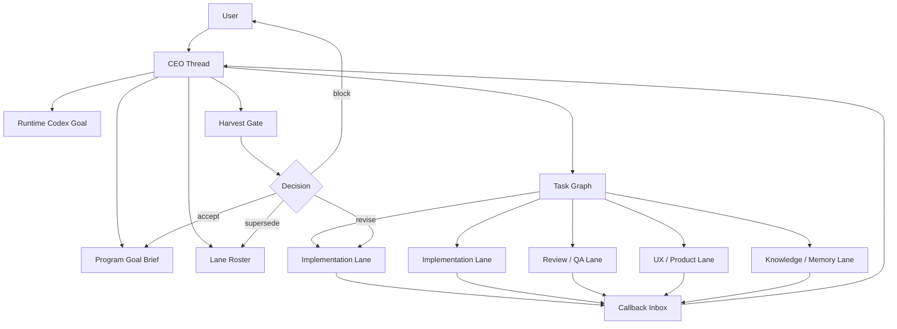
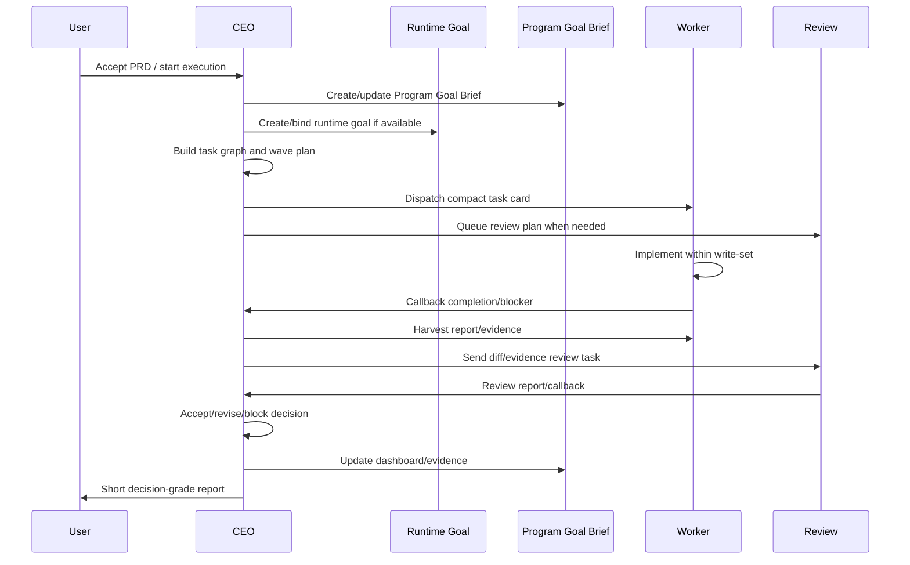

# CEO Flow Communication System Technical Design

Status: draft for review

Owner: CEO Flow

Decision: propose

## 1. Purpose

This document defines how CEO Flow should coordinate communication between the CEO thread, visible worker/review threads, short-lived subagents, runtime goals, and memory providers.

The goal is not to invent a new low-level messaging protocol. CEO Flow should use the host's available thread or agent messaging tools, then add governance rules on top:

- who may send messages;
- what payloads are allowed;
- when callbacks may interrupt the CEO;
- how worker results are harvested;
- what evidence is required before acceptance;
- how Program Goal Brief and runtime Codex Goal stay aligned;
- how parallel work avoids chaos.

## 2. Core Concepts

### 2.1 CEO Thread

The CEO thread is the project brain. It owns:

- product goal;
- PRD or design brief;
- Program Goal Brief;
- task graph;
- lane roster;
- write-set ownership;
- callback inbox policy;
- harvest cadence;
- quality/review gate;
- accept/revise/block/supersede decisions;
- user reporting.

The CEO thread should avoid becoming the default implementation worker for substantial coding/product work.

### 2.2 Visible Lane

A visible lane is a normal Codex thread that the user can see and revisit. It is suitable for persistent roles:

- implementation lane;
- review/QA lane;
- UX/product lane;
- research/docs lane;
- knowledge/memory lane.

Visible lanes are best for work that needs continuity, user visibility, later harvest, or long-lived specialist context.

### 2.3 Subagent

A subagent is a short-lived delegated execution or exploration unit. It is useful for bounded parallel tasks, but it should not be treated as a replacement for a visible lane when the user expects persistent multi-thread project management.

Use subagents for:

- bounded exploration;
- isolated implementation slices with disjoint write-sets;
- parallel verification;
- quick audits.

Avoid subagents for:

- persistent project ownership;
- long-running product lanes;
- visible sidebar coordination;
- work that must later be resumed by the user.

### 2.4 Runtime Codex Goal

A runtime Codex Goal is a host-level continuity driver. It keeps the agent focused on finishing a larger objective.

It must not override CEO Flow routing.

Rule:

```text
Runtime Goal keeps the project alive.
Program Goal Brief remains the source of truth.
CEO Flow still owns staffing, dispatch, harvest, and acceptance.
```

### 2.5 Callback

A callback is a compact signal from a worker/review lane back to the CEO thread.

It is not a separate CEO Flow protocol. It uses whichever safe host messaging surface is available.

Callback is a signal, not proof. CEO still has to inspect evidence before accepting work.

## 3. Communication Surfaces

CEO Flow should discover available communication tools at runtime and choose the safest available surface.

### 3.1 Preferred Surfaces

| Priority | Surface | Best use | Notes |
| --- | --- | --- | --- |
| 1 | Host visible-thread messaging | Worker/review lane -> CEO callback; CEO -> lane dispatch | Best for user-visible project lanes |
| 2 | Host agent messaging | Subagent tasking, follow-up, wait/result collection | Best for short-lived delegated tasks |
| 3 | Thread read/harvest | CEO polls lane reports and evidence | Reliable fallback when callback is unavailable |
| 4 | Document-first relay | Manual or low-tool environments | Task cards/reports saved as files |

### 3.2 High-Risk Surfaces

Do not use history injection or raw session mutation as normal communication.

High-risk surfaces may change model-visible history or raw session state. They should be treated as controlled experiments or maintenance operations, not task messaging.

### 3.3 Tool-Neutral Rule

Public CEO Flow docs should avoid depending on one exact host API name. Tool names may appear as examples, but the rule should be capability-based:

```text
If host thread messaging exists, use it.
If only agent messaging exists, use it for subagents.
If neither exists, rely on harvest and document-first relay.
```

## 4. System Architecture



## 5. Message Types

### 5.1 Dispatch Message

Sent from CEO to a lane.

Required fields:

```text
Task ID:
Parent goal ID:
Role:
Workspace:
Canonical project root:
Allowed work-set:
Do not touch:
Dependencies:
Acceptance criteria:
Required verification:
Context / history budget:
Command approval profile:
Callback policy:
Report back with:
Stop condition:
```

Dispatch messages must be compact. They must not copy long CEO chat history, raw sessions, full knowledge bases, or broad logs.

### 5.2 Callback Message

Sent from worker/review lane to CEO.

Required fields:

```text
Callback type: completion | blocker | approval_stall | revise_needed | safety_risk
Task ID:
Lane ID:
Status:
Changed files or touched artifacts:
Commands/tests run:
Evidence refs:
Blockers:
Residual risk:
Memory candidates:
Requested CEO action:
```

### 5.3 Harvest Request

Issued by CEO when collecting lane state.

```text
Report current task state.
Include changed files, tests, artifacts, blockers, and residual risks.
Do not include long chat history.
Do not ask the user for routine in-scope decisions.
```

### 5.4 Revision Message

Sent from CEO to lane after review.

```text
Decision: revise
Reason:
Evidence inspected:
Required fix:
Allowed write-set:
Do not expand:
Required verification:
Stop condition:
```

### 5.5 Acceptance Message

Recorded by CEO after evidence review.

```text
Decision: accept
Task ID:
Evidence inspected:
Tests/artifacts:
Accepted files or outputs:
Residual risk:
Next task:
Memory update needed:
```

## 6. Callback Interrupt Policy

Callbacks must not randomly derail CEO work.

Default rule:

```text
Worker callbacks are queued harvest signals by default.
Only urgent callback types may interrupt CEO work.
```

### 6.1 Queued Callback

Use queued callback for:

- completion;
- ordinary progress;
- low-risk revise-needed;
- memory candidate;
- informational status.

CEO processes these at the next harvest checkpoint.

### 6.2 Interrupt Callback

Allow interrupt only for:

- blocker that prevents all downstream work;
- approval_stall for an in-scope command/action;
- safety_risk;
- destructive-risk;
- credential/spending/legal/security issue;
- urgent user-visible failure;
- conflicting parallel writes.

### 6.3 Forbidden Callback Use

Workers must not use callback to:

- ask the user routine in-scope questions;
- create new lanes;
- route other workers;
- approve scope changes;
- paste full logs;
- paste long chat history;
- bypass CEO review.

## 7. Runtime Goal Non-Override

Runtime Codex Goal improves continuity, but it can create a failure mode: the CEO thread may keep executing directly because the goal says the project is not done.

Hard rule:

```text
Runtime Codex Goal must not override CEO Flow routing.
For substantial coding/product work, CEO still dispatches lanes or harvests lanes.
Goal state is not permission for direct CEO fallback.
```

The runtime goal should reference the Program Goal Brief path and stay aligned with it.

If they conflict:

```text
Program Goal Brief wins unless the user changes product direction.
```

## 8. Normal Execution Flow



## 9. Parallel Execution Flow

CEO Flow should actively look for parallelism after an accepted PRD/task graph.

Parallel dispatch is allowed only when:

- dependencies are independent;
- write-sets are disjoint or isolated by worktrees;
- shared contracts are stable or assigned to one owner;
- verification is isolated;
- command approvals are planned;
- CEO has harvest capacity.

```text
Wave ID:
Ready tasks:
Blocked / serial tasks:
Lane assignments:
Write-set ownership:
Shared contract owner:
Review plan:
Harvest cadence:
Stop condition:
```

If several tasks are ready and safe, CEO should dispatch or queue each one. If it selects only one, it must record why the others are serial, blocked, unsafe, or over capacity.

## 10. Single-Lane Flow

Some projects cannot safely run multiple writers.

Use one implementation lane plus callback when:

- only one write-set is safe;
- local app state/server/database is shared;
- architecture is unstable;
- merge cost is too high;
- project tool surface cannot isolate work.

In this mode:

- worker callback reduces latency;
- CEO harvest remains the authority;
- read-only review/docs/audit lanes may still run in parallel if they do not compete with the writer.

## 11. Evidence And Acceptance

CEO must not accept based only on a callback.

Minimum acceptance evidence:

- worker report;
- changed files or artifact list;
- commands/tests run;
- failure output when relevant;
- screenshots or generated artifacts for UI/product work;
- review report for high-risk changes;
- residual risk.

Decision states:

```text
accept | revise | block | supersede
```

Callbacks are inputs to the decision, not the decision itself.

## 12. State Records

### 12.1 Program Goal Brief

Durable source of truth for long-running project state.

Must track:

- phase;
- percent complete;
- active lanes;
- blocked lanes;
- accepted work;
- next task;
- evidence;
- harvest cadence.

### 12.2 Lane Roster

Tracks:

```text
Lane ID:
Thread ID or agent ID:
Role:
Workspace:
Write-set:
Status:
Last task:
Last evidence:
Callback policy:
Next harvest:
Lifecycle: active | idle | stale | retired
```

### 12.3 Callback Inbox

Can be implemented as thread messages, agent result messages, or a document/log depending on host capability.

Tracks:

```text
Callback ID:
Timestamp:
From lane:
Task ID:
Type:
Priority: queued | interrupt
Summary:
Evidence refs:
CEO action:
Status: unread | triaged | accepted | revised | blocked | superseded
```

## 13. Memory And History Boundaries

Communication should be compact and source-backed.

Allowed:

- current task goal;
- task card;
- relevant source refs;
- compact knowledge excerpts;
- evidence refs;
- memory candidates.

Forbidden by default:

- full CEO chat transcript;
- full worker transcript;
- raw session content;
- full knowledge base dump;
- broad logs.

If old history is needed, use compact project memory or old-thread summaries first. Raw/cold history remains behind the hard gate defined by the context/memory rules.

## 14. Failure Modes And Controls

| Failure mode | Cause | Control |
| --- | --- | --- |
| CEO becomes implementer | Runtime goal pushes current thread to keep going | Runtime Goal Non-Override |
| Callback interrupts CEO constantly | Every worker sends urgent messages | Callback Interrupt Policy |
| Fake completion | Worker callback claims success without evidence | Acceptance requires evidence inspection |
| Sidebar chaos | Too many visible lanes | Lane roster, planned titles, archive/retire policy |
| Workspace drift | New lane starts in wrong folder | Workspace Root Guard |
| Parallel write collision | Two lanes edit same module | Write-set ownership and integration owner |
| Context bloat | Dispatch copies long history | Compact task cards and history budget |
| User approval stalls | Worker asks user routine questions or host approval blocks a covered action | No-Stall Worker Mode; worker reports to CEO; CEO continues covered actions or routes around stalled lane |
| Memory pollution | Worker writes unverified lessons | Memory candidates only; CEO/provider promotes |

## 15. MVP Implementation Rules For CEO Flow

These rules should be reflected in the skill/reference files:

1. Runtime Goal Non-Override
   - Runtime Codex Goal must not authorize direct CEO fallback.
   - CEO still routes substantial work through lanes unless direct-current-thread execution is explicitly allowed.

2. Callback Interrupt Policy
   - Completion callbacks are queued.
   - Blocker, approval_stall, safety_risk, destructive-risk, and urgent user-visible failures may interrupt.

3. Communication Surface Discovery
   - Discover visible thread messaging, agent messaging, thread read/harvest, automations, and document-first fallback before promising orchestration.

4. Callback Payload Contract
   - Every task card should define callback events, method, payload, fallback, and interrupt priority.

5. Harvest Authority
   - Callback never replaces CEO harvest and evidence review.

6. Parallel Wave Discipline
   - Dispatch all safe ready tasks or record why each ready task is not dispatched.

7. Workspace Guard
   - Every lane task card must include canonical root and workspace verification.

8. No-Stall Worker Mode
   - CEO-created worker/review lanes should treat routine in-scope approvals as CEO-routed, not user-routed.
   - Approval stalls are lane-local unless no safe fallback exists.
   - If host UI approval is still required, record `HOST_APPROVAL_REQUIRED`, mark the lane `approval_stalled`, and continue other safe ready tasks.

## 16. Open Questions

1. Should CEO Flow keep a structured callback inbox document for long-running projects, or rely on Program Goal Brief plus lane roster?
2. Should completion callbacks be batched by default during high-parallel waves?
3. Should task cards include an explicit `Callback priority` field?
4. Should visible lanes and subagents share one roster format or use separate sections?
5. Should runtime goal binding be tested with a smoke prompt that verifies CEO does not directly implement after goal creation?

## 17. Recommended Next Patch

Small skill patch:

- Add `Runtime Goal Non-Override` to `SKILL.md` Goal Loop or Critical Path.
- Add `Callback Interrupt Policy` to `references/thread-ops.md`.
- Add `Callback priority` to Task Card Minimum.
- Add one smoke prompt: runtime goal must not cause CEO direct implementation.
- Add one smoke prompt: completion callback is queued; blocker callback may interrupt.
- Add one smoke prompt: in-scope approval stalls do not block the whole Program Goal.

Do not add a heavy scheduler or custom RPC layer.

## 18. CEO Decision

Decision: revise before implementation

Reason:

The current CEO Flow communication model is directionally correct, but two rules should be made explicit before relying on it for large unattended projects:

- runtime goals must not collapse CEO Flow into single-thread execution;
- worker callbacks must be queued by default and interrupt only under defined conditions.
- in-scope approval stalls must be routed to CEO and treated as lane-local unless no fallback can continue.

Once those two are added, the communication system is coherent enough for local testing.
