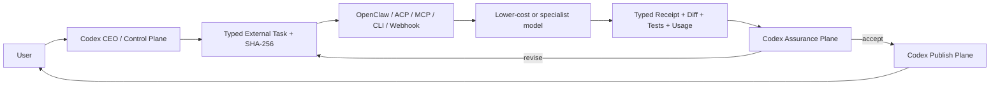

# CEO Flow Cross-Platform External Execution Upgrade

Date: 2026-07-20
Contract decision: **accept**
Live provider deployment: **accept for R0 MiniMax typed execution/session reuse; revise until one disposable R1 code-writing pilot passes**

## Objective

Reduce expensive Codex execution usage without weakening project control:

- Codex owns user intent, architecture, task graph, risk classification, evidence review, acceptance, memory writeback, and publication.
- OpenClaw or another cross-platform agent host uses lower-cost models for bounded implementation, tests, research, and documentation.
- Higher-capability models handle architecture, difficult integration, security, neutral review, and release gates.
- Provider outputs return as typed, hash-bound evidence rather than long reasoning transcripts.

## Architecture



External completion is a claim. Codex acceptance remains a separate decision.

## Verified Local Reference Surface

Read-only discovery found:

- OpenClaw `2026.7.1-2` with a reachable local Gateway and JSON CLI surface.
- `openclaw agent --json` with agent, session, model, thinking, and timeout controls.
- JSON stdout reserved for machine parsing; diagnostics use stderr.
- `openclaw tasks` provides a durable activity ledger with queued/running/terminal states, audit, cancel, and JSON inspection.
- OpenClaw documentation says detached completion is push-driven and polling loops are usually the wrong shape.
- ACP supports provenance modes including `meta+receipt`.

A controlled real-model smoke used the configured `minimax/MiniMax-M3` route. Two hash-bound R0 tasks returned valid receipts from the same deterministic project-role session. No provider credential, model alias, Goal, heartbeat, channel delivery, or publication setting was changed. See `docs/smoke/CEO_FLOW_OPENCLAW_MINIMAX_SESSION_REUSE_2026-07-20.md`.

## Implemented Files

Core policy:

- `skills/ceo-thread-orchestrator/references/external-execution.md`
- `skills/ceo-thread-orchestrator/references/model-routing.md`
- `skills/ceo-thread-orchestrator/SKILL.md`
- `skills/ceo-thread-orchestrator/references/state-schema.md`

Typed exchange:

- `skills/ceo-thread-orchestrator/schemas/external-execution-task.schema.json`
- `skills/ceo-thread-orchestrator/schemas/external-execution-receipt.schema.json`
- `skills/ceo-thread-orchestrator/templates/external_execution_task.json`
- `skills/ceo-thread-orchestrator/templates/external_execution_receipt.json`

Executable bridge and assurance:

- `skills/ceo-thread-orchestrator/scripts/external_execution_bridge.py`
- `skills/ceo-thread-orchestrator/templates/scorecard.md`
- `tests/test_external_execution_bridge.py`
- `integrations/openclaw/skills/ceoflow-external-executor/SKILL.md`

## Routing Policy

| Tier | Default executor | Codex responsibility |
| --- | --- | --- |
| R0 mechanical | lower-cost external `fast` | deterministic gate and bounded sampling |
| R1 bounded implementation/test | external `balanced` | inspect receipt, diff, tests, and evidence |
| R2 complex integration | strongest adequate measured route | architecture constraints and independent high-capability review |
| R3 critical/security/release | Codex/frontier control and assurance | decision, neutral audit, user boundary, publication |

Domestic and foreign providers use the same evidence contract. Country/model name alone does not establish cost, privacy, capability, or quality.

## Safety Boundaries

External executors default to:

```text
publishAllowed: false
mergeAllowed: false
releaseAllowed: false
externalMessagingAllowed: false
delegationAllowed: false
```

They receive only compact task context and project-relative sourceRefs. They must not receive raw CEO chat, full ProjectBrain, raw sessions, unrelated secrets, image/base64 payloads, or giant logs.

The bridge:

- validates task and receipt envelopes;
- binds receipts to canonical task JSON with SHA-256;
- verifies write-set compliance;
- rejects escaped output paths;
- redacts secret/base64 patterns from saved raw CLI output;
- keeps OpenClaw execution disabled unless `run-openclaw` receives explicit `--execute`;
- does not add `--deliver`, so internal execution does not message a user channel;
- refuses oversized CLI prompts and directs large tasks to file exchange or ACP.
- uses `--message-file` for real multiline execution so Windows launchers cannot truncate the typed envelope;
- reuses deterministic project-role session keys and requires a reason before isolated rotation.

## Goal And Harvest Policy

The user paused runtime Goals. This upgrade preserves that state.

For external execution, use provider push completion, immediate synchronous harvest, explicit user-requested harvest, or configured TaskFlow notification. Do not add a Codex heartbeat or repeatedly poll the external task ledger.

## Pilot Rollout

1. Configure one OpenClaw execution Agent and lower-cost model alias outside the public skill. **Done for `main` + MiniMax.**
2. Run `validate-task` and `render-openclaw`; inspect the command without execution. **Done.**
3. Execute R0 read/test-only disposable tasks with `--execute`, reusing one project-role session. **Done twice.**
4. Validate returned receipts and independently inspect evidence in Codex. **Done; both receipts passed.**
5. Try one R1 bounded write-set task in a clean worktree/prepared snapshot. **Pending.**
6. Keep GitHub push, merge, release, external messaging, and production operations in Codex/user-controlled publish plane.

## Remaining Live Questions

- What are MiniMax's measured cost, coding/tool-use quality, and data-residency properties for this deployment?
- Which projects may leave the local machine and which require local/private endpoints?
- Should OpenClaw report usage directly or through a provider billing sidecar?

These are deployment inputs, not reasons to weaken the provider-neutral skill contract.
# Supersession note (2026-07-21)

The original R0 evidence below validated the then-current permanent project-role session design. Current policy supersedes physical-session reuse with a stable logical lane plus one clean, archived physical session generation per bounded task. Treat the same-session observations below as historical evidence, not current dispatch guidance.
