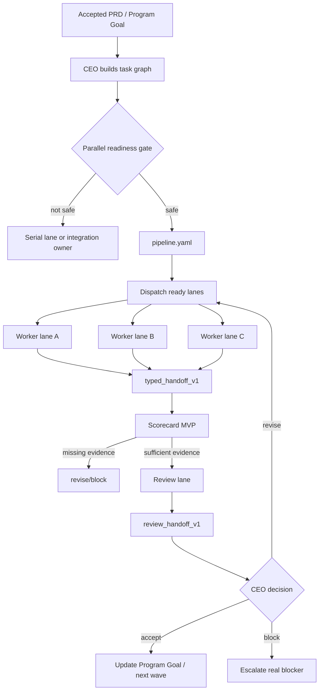

# CEO Flow Pipeline MVP Test And Full PRD

Date: 2026-06-16
Status: upgraded-to-template-and-validator-implementation
Scope: CEO Thread Orchestrator / CEO Flow pipeline layer

## 1. Executive Summary

Current CEO Flow now has an MVP pipeline layer. It is not a full workflow engine yet. The MVP adds a lightweight planning contract on top of existing task cards and parallel waves:

- optional `pipeline.yaml` or equivalent Program Goal section;
- explicit lane ids, dependencies, write-set ownership, and stop conditions;
- typed handoff schema for worker/review reports;
- Scorecard MVP for evidence triage;
- smoke prompts for pipeline and handoff behavior.

Compared with the previous version, the main difference is that CEO Flow no longer only says "parallelize when safe". It now has a minimal structure for proving whether parallelism is safe and for harvesting evidence in a machine-checkable way.

Decision: the original MVP is now upgraded into a practical pipeline support layer with templates and lightweight validators. It is still intentionally not a full automatic graph runner.

## 2. Test Method

This was a lightweight static/smoke audit. It did not create real worker threads or run destructive operations.

Inputs checked:

- Upgrade baseline backup: local pre-upgrade backup snapshot, path recorded outside public docs.
- Current repo skill: `skills/ceo-thread-orchestrator/SKILL.md`
- Current parallel reference: `skills/ceo-thread-orchestrator/references/parallel-waves.md`
- New pipeline reference: `skills/ceo-thread-orchestrator/references/pipeline-contract.md`
- Smoke prompts: `examples/smoke-prompts.md`

Test type:

1. Diff-based comparison against backup.
2. Rule coverage check for parallel dispatch.
3. Smoke prompt behavior expectation review.
4. MVP vs full-version gap analysis.

## 3. Old Version vs Current MVP

| Area | Previous behavior | Current MVP behavior | Practical effect |
| --- | --- | --- | --- |
| Parallel model | Parallel waves only | Parallel waves plus optional pipeline contract | CEO has a more explicit dispatch plan |
| Task graph | Natural-language wave plan | `pipeline.yaml` / Program Goal pipeline section allowed | Easier to audit dependencies |
| Worker output | Report-back fields in task card | Typed handoff recommended for pipeline lanes | Easier to reject vague "done" reports |
| Review | CEO reads report/diff/tests | Scorecard MVP checks format/write-set/evidence first | Weak reports are caught earlier |
| Environment | Mentioned indirectly through commands/resources | Environment profile added | Better handling of port/db/browser conflicts |
| Automation level | Manual CEO orchestration | Still manual, but more structured | Not yet a workflow engine |
| Failure mode | Collapse to serial if conflict | Same, with scorecard/contract triggers | Safer fallback path |

## 4. MVP Smoke Test Results

### Test 1: Accepted PRD with backend/frontend/docs-test work

Prompt under test:

```text
Use CEO Flow. An accepted PRD has independent backend, frontend, and docs/test work. Do not edit files or create threads in this smoke test. Decide whether to create a lightweight pipeline contract, and show the minimum fields needed for safe parallel dispatch.
```

Expected current behavior:

- Recommend a small `pipeline.yaml` or equivalent Program Goal section.
- Include lane ids, dependencies, write-set owners, environment profile, typed handoff schema, scorecard/review gate, and stop conditions.
- Avoid heavyweight workflow engine claims.
- Avoid serializing everything through one worker unless a conflict is stated.

Result: pass by rule coverage. The current skill and smoke prompt explicitly require this behavior.

### Test 2: Worker says "done" without evidence

Prompt under test:

```text
Use CEO Flow. A worker lane reports "done" for a pipeline task but provides no structured handoff, changed files, command output, or residual risk. Do not edit files or create threads in this smoke test. Decide accept/revise/block and state what the Scorecard MVP should require.
```

Expected current behavior:

- Revise or block, not accept.
- Require typed handoff fields.
- Require changed files, write-set compliance, command result or not-run reason, blockers/assumptions, and recommended next action.
- State Scorecard is evidence triage, not a replacement for neutral review.

Result: pass by rule coverage. The new pipeline reference defines these Scorecard MVP fields.

### Test 3: Compare with previous parallel waves

Previous `parallel-waves.md` already had:

- parallel readiness;
- write-set constraints;
- dependency graph;
- lane count guidance;
- harvest classification.

New MVP adds:

- pipeline contract pointer;
- typed handoff schema;
- scorecard checks;
- environment profile;
- explicit "not a heavyweight workflow engine" boundary.

Result: pass. The new layer is additive and does not remove previous safety gates.

## 5. Current MVP Limitations

The MVP is still mostly prompt/skill-level governance. It does not yet provide:

1. A script that validates `pipeline.yaml` syntax.
2. Automatic write-set conflict detection from Git diff.
3. Automatic typed handoff parsing.
4. Automatic scorecard execution.
5. A real graph scheduler that dispatches lanes by topological order.
6. Lane state persistence beyond Program Goal/roster docs.
7. Automatic merge/conflict resolution.
8. Environment locks for ports/databases/browsers.
9. A queue UI showing ready/running/blocked/done lanes.
10. Verified callback acknowledgements from every worker lane.

So the current version improves CEO judgment and reporting, but it is not yet a complete unattended multi-agent pipeline system.

## 6. Full Version PRD: CEO Flow Pipeline Layer

### 6.1 Product Goal

Build a lightweight, auditable pipeline layer for CEO Flow so accepted PRDs can be decomposed into safe parallel lanes, dispatched with bounded task cards, harvested through typed handoffs, checked by Scorecard, and accepted/revised/blocked by CEO without turning the system into a heavy autonomous workflow engine.

### 6.2 User Problem

Users want CEO Flow to finish larger software/project goals faster. Current behavior can still drift into:

- one CEO thread doing too much alone;
- one worker lane handling an entire PRD serially;
- vague worker reports that are hard to verify;
- parallel attempts without clear write-set/resource ownership;
- long chats replacing structured evidence.

### 6.3 Target Users

- Individual developers using Codex Desktop with visible threads.
- Project owners who want unattended or semi-unattended progress.
- CEO Flow maintainers testing multi-thread orchestration.
- Advanced users with Zhixia/project-memory for context governance.

### 6.4 Non-Goals

- Do not build a full enterprise workflow engine in the first release.
- Do not recreate legacy heavy automatic workflow systems.
- Do not let agents freely chat without structured handoff.
- Do not bypass Codex host security approvals.
- Do not automatically mutate user sessions, delete logs, or manage OS state.
- Do not claim completion from messages alone without evidence.

## 7. Functional Requirements

### FR1: Pipeline Contract Generation

When a PRD/task graph has multiple independent workstreams, CEO Flow should create or update a pipeline contract.

Minimum fields:

```yaml
pipeline:
  id:
  goalBrief:
  mode:
  stopCondition:

lanes:
  - id:
    role:
    taskCard:
    dependsOn:
    parallelWith:
    writeSet:
    doNotTouch:
    environmentProfile:
    reportFormat:
    requiredVerification:
```

Acceptance:

- Pipeline contract exists for broad multi-module PRDs.
- Every ready lane has dependency and write-set declarations.
- Ready-but-undispatched lanes have a reason.

### FR2: Parallel Readiness Decision

CEO Flow must decide whether tasks can run in parallel using:

- dependency independence;
- write-set ownership;
- shared contract stability;
- environment/resource conflicts;
- approval readiness;
- review/harvest capacity;
- rollback baseline and stop condition.

Acceptance:

- CEO does not dispatch parallel lanes when write-sets or contracts conflict.
- CEO does not serialize independent lanes without stating a reason.

### FR3: Typed Worker Handoff

Worker lanes in pipeline mode must report using `typed_handoff_v1`.

Required fields:

- schema;
- laneId;
- status;
- summary;
- accepted scope / out of scope;
- files changed;
- write-set compliance;
- commands run and result;
- risks/assumptions/blockers;
- recommended next action;
- provenance.

Acceptance:

- Vague "done" reports are revise/block.
- CEO harvest starts from typed handoff and evidence, not long chat.

### FR4: Review Handoff

Review lanes use `review_handoff_v1`.

Required fields:

- schema;
- laneId;
- decision;
- evidence inspected;
- reasons;
- missing evidence;
- required fixes;
- residual risk;
- confidence.

Acceptance:

- Review decision must be `accept`, `revise`, or `block`.
- Review remains neutral and evidence-first.

### FR5: Scorecard MVP

Scorecard checks should validate hard facts:

1. Parseable handoff.
2. Required identity fields.
3. Write-set compliance.
4. Verification evidence exists or has a not-run reason.
5. Failed tests/blockers/assumptions are visible.
6. Dependencies are satisfied before review accept.
7. CEO decision gate exists.

Acceptance:

- Scorecard can reject insufficient reports before CEO spends deep review time.
- Scorecard does not replace human/CEO judgment.

### FR6: Environment Profiles

Pipeline lanes may declare environment profiles to prevent conflicts.

Examples:

- project-default;
- browser-capable;
- db-migration-owner;
- e2e-singleton;
- read-only-review.

Acceptance:

- Two lanes needing exclusive resources are not launched simultaneously unless isolated.
- Port/db/browser conflicts are explicitly declared.

### FR7: Harvest Queue

CEO Flow should maintain a harvest queue for pipeline waves.

Lane states:

```text
planned | dispatched | running | callback_received | ready_for_review | accepted | revise | blocked | stale | superseded
```

Acceptance:

- CEO can see which lanes are ready, blocked, stale, or accepted.
- Runtime Goal can serve as harvest driver, but does not replace evidence review.

### FR8: Failure Collapse

When parallelism creates conflict, CEO Flow collapses to a serial integration owner.

Triggers:

- same file conflict;
- unstable shared contract;
- repeated invalid handoff;
- repeated approval stalls;
- exceeded review capacity;
- environment contention.

Acceptance:

- CEO records why parallelism was stopped.
- Existing lane work is preserved as evidence, not blindly discarded.

## 8. System Design: Full Version



## 9. Suggested Release Phases

### Phase 0: Current MVP

Already done locally:

- skill rule entry;
- pipeline-contract reference;
- smoke prompts;
- installed skill sync;
- validator pass.

### Phase 1: Template Pack

Add files:

- `templates/pipeline.yaml`
- `templates/typed_handoff.yaml`
- `templates/review_handoff.yaml`
- `templates/scorecard.md`

Acceptance:

- CEO can generate consistent artifacts without retyping schemas.

Status: implemented in the skill package.

### Phase 2: Static Validator Script

Add script:

- `scripts/validate_pipeline.py` or `.js`

Checks:

- YAML parses;
- lane ids unique;
- dependencies point to existing lanes;
- required fields exist;
- review lanes depend on at least one upstream lane;
- write-set overlaps are flagged.

Acceptance:

- Validator catches malformed pipeline contracts.

Status: implemented as `scripts/validate_pipeline.py`.

### Phase 3: Handoff Scorecard Script

Add script:

- `scripts/scorecard_handoff.py` or `.js`

Checks:

- typed handoff schema;
- required fields;
- write-set compliance from declared paths;
- required verification result presence;
- missing evidence.

Acceptance:

- CEO can run scorecard before accepting lane reports.

Status: implemented as `scripts/scorecard_handoff.py`.

### Phase 4: Harvest Queue Document

Add Program Goal section or generated doc:

```text
Harvest queue:
Lane ID | Thread ID | Status | Last callback | Evidence | Next action
```

Acceptance:

- Long-running projects do not rely on chat memory to know what is active.

### Phase 5: Optional Runtime Tooling

Only after manual contract works:

- detect write-set overlaps from actual Git diff;
- generate lane task cards from pipeline;
- update harvest queue from handoff files;
- optional visualization of DAG.

Acceptance:

- Tooling reduces manual work without hiding CEO decisions.

## 10. Recommended Next Implementation Step

Do not jump directly to a graph runner.

Recommended next step:

1. Test the bundled templates and validators in a fresh Codex thread with a fake PRD.
2. Use the validators in a real but low-risk multi-lane project.
3. If stable, add optional harvest queue document generation.
4. Only then consider DAG visualization or automatic lane dispatch helpers.

This keeps CEO Flow lightweight while making parallel execution more reliable.

## 11. Risks

| Risk | Severity | Mitigation |
| --- | --- | --- |
| Skill becomes too complex | High | Keep SKILL.md lean; move details to references/templates |
| Agents fake structured reports | Medium | Scorecard requires evidence refs and command output |
| Parallel workers conflict | High | Write-set ownership and environment profile gate |
| CEO becomes passive scheduler | Medium | CEO decision gate remains final authority |
| Too much YAML slows use | Medium | Use pipeline only for broad PRDs; tiny tasks stay direct/simple |
| False confidence from Scorecard | High | Scorecard is triage, not proof |
| Host approvals still block workers | Medium | No-stall worker mode + approval_stall callback |

## 12. CEO Decision

Decision: accept upgraded pipeline support layer, continue toward harvest queue and optional visualization after real-thread testing.

The pipeline layer now includes templates and validators. It is no longer only an MVP concept, but it remains deliberately lighter than a full autonomous workflow engine.
